# Installing the Stripe app for Adobe Commerce

## Overview

This guide walks you through installing the Stripe app for **Adobe Commerce** with Adobe App Builder and Adobe Commerce App Management. The app integrates Stripe payment processing with Adobe Commerce through out-of-process extensibility, so the payment app runs independently in Adobe I/O Runtime and integrates with your [Adobe Commerce Storefront](https://experienceleague.adobe.com/developer/commerce/storefront/) through GraphQL APIs, REST APIs, and Adobe I/O Events.

## Supported platforms

The Stripe app supports both:

- **Adobe Commerce as a Cloud Service (SaaS)** - Fully managed cloud service
- **Adobe Commerce on cloud infrastructure and on-premises (PaaS)** - Self-hosted or managed infrastructure

> **Note:** Throughout this documentation, "PaaS" is used as shorthand for "Adobe Commerce on cloud infrastructure and on-premises" to improve readability.

> **PaaS Users**: PaaS-specific sections are labeled **[PaaS Only]**. These include installing the `module-out-of-process-payment-methods` module and configuring integration permissions.

Choose the appropriate setup instructions below based on your deployment type.

## Supported payment flows

After installation, the app supports these merchant flows:

- Stripe payment methods enabled in the [Stripe payment methods dashboard](https://dashboard.stripe.com/settings/payment_methods).
- Redirect-based payment methods when success and failure page URLs are configured.
- Automatic capture during checkout or manual capture by invoicing the order in Commerce Admin.
- Full and partial refunds by creating credit memos in Commerce Admin.
- Optional saved payment methods for supported payment methods.

## Before you begin

### Set up Adobe Commerce Instance

#### **[SaaS Only]** Adobe Commerce as a Cloud Service

Before you begin, you will first need to have an instance of Adobe Commerce as a Cloud Service running. You can create one by:

1. Navigating to [Experience Cloud Console](https://experience.adobe.com/)
1. Under **Quick Access**, click **Commerce**
1. At the top right hand side of the page, click **Add instance**

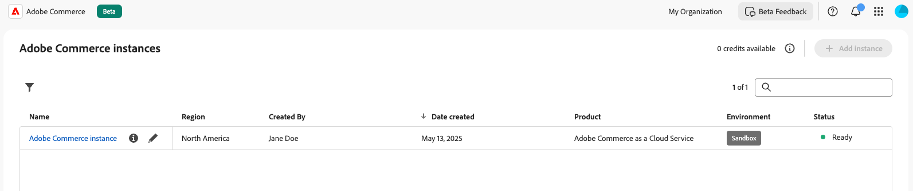

If you are testing the app on a sandbox / development environment, you can import [available sample data](https://github.com/slamech/commerce-sample-data) from Adobe to your Commerce instance.

#### **[PaaS Only]** Adobe Commerce on-premises/cloud infrastructure

For PaaS deployments, ensure you have:

1. Adobe Commerce 2.4.5+ installed and running. For installation guidance, see Adobe's [Adobe Commerce installation guide](https://experienceleague.adobe.com/en/docs/commerce-operations/installation-guide/overview).
1. Access to your Adobe Commerce Admin URL. For Adobe Commerce on cloud infrastructure, find the Admin URL in your Cloud project environment. See Adobe's [Cloud Console guide](https://experienceleague.adobe.com/en/docs/commerce-cloud-service/user-guide/project/overview). For on-premises environments, use the Admin URL configured for your Commerce installation.
1. API credentials for the authentication method your PaaS environment uses:
   - IMS authentication: use the OAuth Server-to-Server credential from [Adobe Developer Console](https://developer.adobe.com/console/).
   - Commerce integration authentication: create or open the integration in **System** > **Extensions** > **Integrations** in Commerce Admin, activate it, and copy the Consumer Key, Consumer Secret, Access Token, and Access Token Secret. See Adobe's [Commerce integration guide](https://experienceleague.adobe.com/en/docs/commerce-admin/systems/integrations).
1. Required out-of-process payment, eventing, IMS, and Admin UI SDK modules installed from the Commerce application root directory:

   ```bash
   # Run from the Adobe Commerce application root directory, where bin/magento exists
   composer require magento/module-out-of-process-payment-methods:^0.4.0
   composer require magento/commerce-eventing
   composer require magento/commerce-backend-sdk:^3.0
   composer require magento/adobe-ims

   php bin/magento module:enable \
     Magento_OutOfProcessPaymentMethods \
     Magento_AdobeCommerceEventsClient \
     Magento_AdobeCommerceEventsGenerator \
     Magento_AdobeCommerceEventsMeta \
     Magento_AdminUISDK \
     Magento_AdobeIms \
     Magento_AdminAdobeIms

   php bin/magento setup:upgrade
   php bin/magento setup:di:compile
   php bin/magento cache:flush
   ```

   Required PaaS module versions:

   | Module                                          | Required version                              |
   | ----------------------------------------------- | --------------------------------------------- |
   | `magento/module-out-of-process-payment-methods` | `^0.4.0`                                      |
   | `magento/commerce-eventing`                     | Version compatible with Adobe Commerce 2.4.5+ |
   | `magento/commerce-backend-sdk`                  | `^3.0`                                        |
   | `magento/adobe-ims`                             | Version compatible with Adobe Commerce 2.4.5+ |

1. Admin UI SDK v3.0+ configured for IMS authentication compatibility. For PaaS IMS setup, enable Adobe IMS from the Commerce application root directory:

   ```bash
   # Run from the Adobe Commerce application root directory, where bin/magento exists
   php bin/magento admin:adobe-ims:enable
   php bin/magento cache:flush
   ```

   When prompted, enter the Organization ID, Client ID, and Client Secret from the OAuth Web App credential in [Adobe Developer Console](https://developer.adobe.com/console/). Then verify **Stores** > **Configuration** > **Adobe Services** > **Admin UI SDK** shows Admin UI SDK enabled and the **Configure extensions** button is available.

1. Verify the required modules are installed and enabled:

   ```bash
   # Run from the Adobe Commerce application root directory, where bin/magento exists
   composer show magento/module-out-of-process-payment-methods
   composer show magento/commerce-eventing
   composer show magento/commerce-backend-sdk
   composer show magento/adobe-ims

   php bin/magento module:status Magento_OutOfProcessPaymentMethods
   php bin/magento module:status Magento_AdobeCommerceEventsClient
   php bin/magento module:status Magento_AdobeCommerceEventsGenerator
   php bin/magento module:status Magento_AdobeCommerceEventsMeta
   php bin/magento module:status Magento_AdminUISDK
   php bin/magento module:status Magento_AdobeIms
   php bin/magento module:status Magento_AdminAdobeIms
   ```

> **Important**: The `magento/module-out-of-process-payment-methods` module is required for PaaS deployments. Without it, Stripe configuration saves will fail with 404 errors.

For sample data on PaaS environments, refer to the [official Adobe Commerce sample data guide](https://experienceleague.adobe.com/en/docs/commerce-on-cloud/user-guide/develop/test/sample-data).

### Set up your Stripe account

You can register for a Stripe account via [Stripe's website](https://dashboard.stripe.com/register). After registering, you can access your Stripe API keys via:

- Test Mode: [https://dashboard.stripe.com/test/apikeys](https://dashboard.stripe.com/test/apikeys)
- Live Mode: [https://dashboard.stripe.com/apikeys](https://dashboard.stripe.com/apikeys)

### Configure Authentication

#### IMS Authentication (Recommended)

IMS (Identity Management Service) authentication is the recommended approach for both SaaS and PaaS deployments:

- **[SaaS Only]** IMS authentication is required. However, the current implementation allows Commerce integration authentication as a fallback if `OAUTH_CLIENT_ID` is missing. This fallback behavior may change in future releases.
- **[PaaS Only]** IMS authentication enables easier migration to SaaS and provides access to Admin UI SDK features

For both deployment types, IMS authentication allows the app to:

- Access Adobe Commerce APIs securely
- Integrate with Adobe Admin UI SDK v3.0+
- Work within Experience Cloud Shell environments

#### **[PaaS Only]** Integration Authentication (Alternative)

PaaS deployments can alternatively use Commerce Integration authentication (OAuth 1.0a):

1. Navigate to **System** > **Extensions** > **Integrations** in your Commerce Admin
1. Click **Add New Integration**
1. Fill in the integration details.
1. On the **API** tab, grant the permissions required for out-of-process payment methods, including `Magento_OutOfProcessPaymentMethods`.
1. Save and activate the integration.
1. Copy the Consumer Key, Consumer Secret, Access Token, and Access Token Secret from the activated integration. These values map to `COMMERCE_CONSUMER_KEY`, `COMMERCE_CONSUMER_SECRET`, `COMMERCE_ACCESS_TOKEN`, and `COMMERCE_ACCESS_TOKEN_SECRET` in `.env`.

**Note:** While integration authentication works for PaaS, Adobe recommends using IMS authentication to ease future migration to SaaS.

### Set up App Builder

#### Obtain a license

You will need a [license for App Builder](https://developer.adobe.com/app-builder/docs/get_started/app_builder_get_started/set-up#access-and-credentials) in order to deploy the app. App Builder is necessary so that you can configure IMS authentication credentials, configure Commerce I/O Events, persist data to Adobe I/O Lib Files, or generate encryption keys for your environment file.

You can sign up to a trial of App Builder via [https://developer.adobe.com/app-builder/trial/](https://developer.adobe.com/app-builder/trial/).

#### Create the project

Once you have an App Builder license, navigate to [Adobe Developer Console](https://developer.adobe.com/console/). You should see there a **Create project from template**
button, indicating that your App Builder license is active:

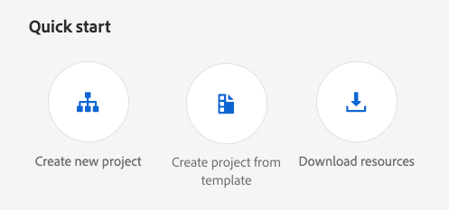

Click on the **Create project from template** button, and select App Builder as a template:

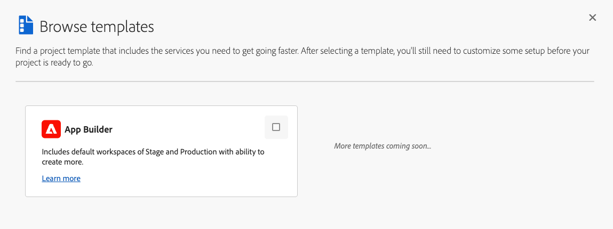

Fill the project details and click save:

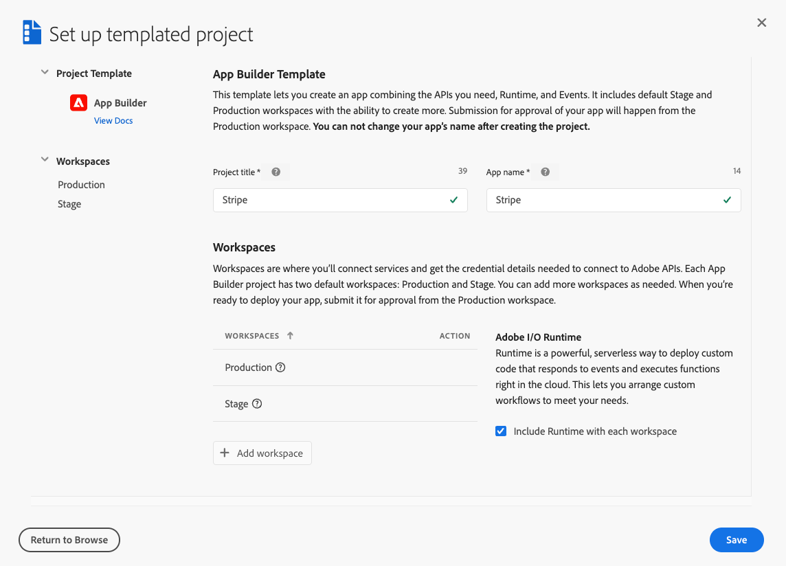

#### Add required APIs to the project

1. Select an environment, such as **Stage** or **Production**, click the **Add service** button, and then select **API**.

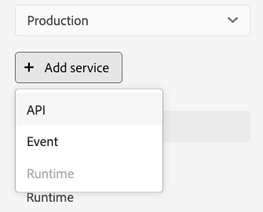

1. Add **Adobe Commerce as a Cloud Service** to the environment by selecting **Add service** > **API** > **Adobe Commerce as a Cloud Service**. This API provides the Commerce scopes used by the app's OAuth credentials.

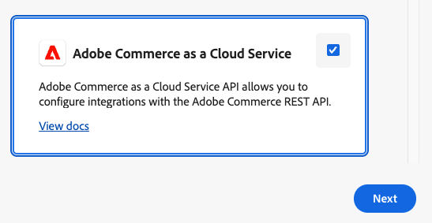

1. Add **Adobe I/O Events for Adobe Commerce** to the environment by selecting **Add service** > **API** > **Adobe I/O Events for Adobe Commerce**. This API supports Commerce event provider and registration setup.

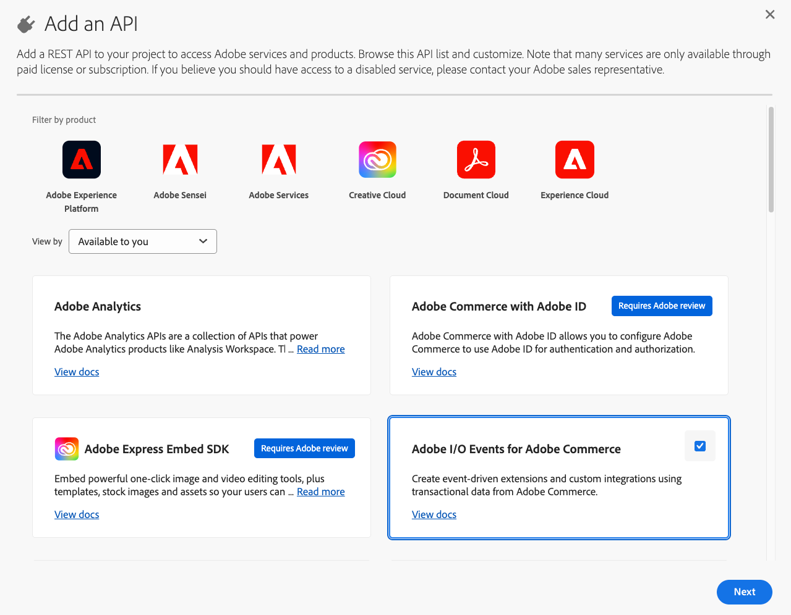

1. Add **I/O Management API** to the environment by selecting **Add service** > **API** > **I/O Management API**. The setup scripts and runtime actions use this API to read workspace metadata and manage event configuration.

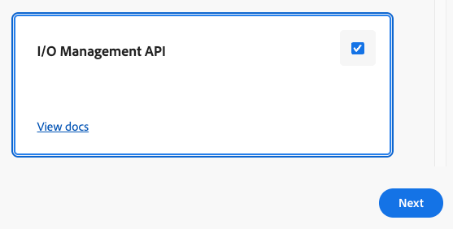

1. Add **Admin UI SDK** if it is available in your organization by selecting **Add service** > **API** > **Admin UI SDK**. App Management uses Admin UI SDK compatibility for the Commerce Admin configuration experience.


Do not create Commerce event registrations manually for a standard App Management installation. App Management creates the Commerce event provider and event registrations automatically when the app is installed.

#### Add workspace credentials

After creating the workspace and adding the required APIs, add the credentials required by the app.

1. In [Adobe Developer Console](https://developer.adobe.com/console/), open the project and workspace where the app will be deployed.
1. Click **Add service** and select **OAuth Server-to-Server**.
1. Configure the OAuth Server-to-Server credential for the Adobe APIs used by the app, including Adobe Commerce as a Cloud Service, Adobe I/O Events for Adobe Commerce, and I/O Management API.

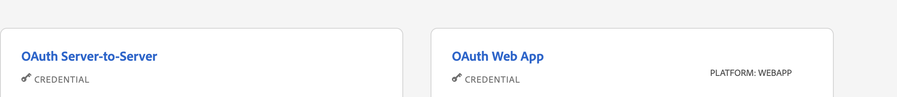

1. Save the credential.
1. Confirm the workspace now shows an **OAuth Server-to-Server** credential.

   The app runtime actions use this credential to call Adobe APIs. The `npm run sync-oauth-credentials` command must be run from the Stripe app project root directory, where `app.config.yaml` and `.env` are located. It reads this credential from the selected workspace and writes the matching `OAUTH_*` values to `.env`. For more information, see Adobe's [OAuth Server-to-Server authentication documentation](https://www.adobe.com/go/devs_authentication).

1. Click **Add service** again and select **OAuth Web App**.
1. Configure the OAuth Web App credential for the same workspace.

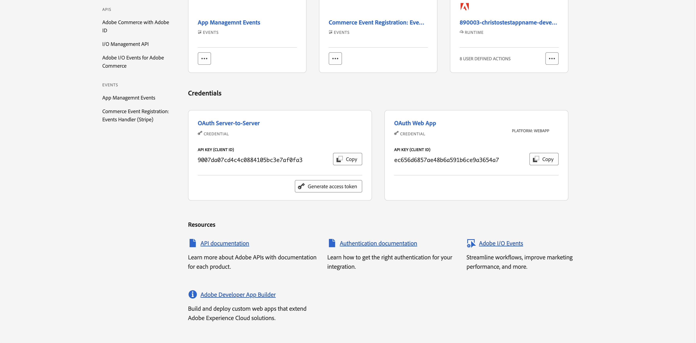

1. Save the credential.
1. Confirm the workspace now shows an **OAuth Web App** credential.

   Adobe Commerce App Management and the Commerce Admin association flow use this credential.

Use the credentials from your own Adobe Developer Console workspace. Do not reuse API keys or client IDs from another organization, project, or workspace.

#### Set up your local environment

Before you can deploy the app to App Builder, you will additionally need to install **Node.js** and the **Adobe I/O CLI** package.
Please follow [the official instructions](https://developer.adobe.com/app-builder/docs/get_started/app_builder_get_started/set-up#local-environment-setup) to set up your local environment.

## Install the App via Adobe Exchange Marketplace and App Management

To install the Stripe app, follow the steps below:

1. Navigate to the app's listing on the [Adobe Exchange Marketplace](https://exchange.adobe.com/apps/browse/ec?appType=ABD&listingType=applications&page=1&partnerLevel=All&product=COMMC&q=stripe&sort=RELEVANCE)
1. Click on the app listing to view it.
1. At the top right hand side, click the **Free** button and follow the instructions to install the app into your organization's environment.
1. The app will appear under [Adobe Exchange App Management](https://exchange.adobe.com/manage). If you are an account admin, click the **Review** button on the app page in order to approve it.
1. At the app's page, you will see a **Download Code** button at the top bar. Click it to download the app's code locally. You will need the code to set up your OAuth Credentials.

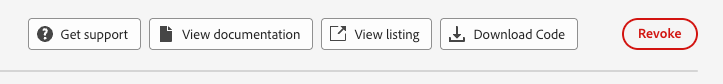

1. Extract the downloaded code to a local directory, and use the CLI to select the same [Adobe Developer Console](https://developer.adobe.com/console/) organization, project, and workspace:

   ```sh
   # Navigate to the extracted project directory
   cd path/to/extracted/stripe-app

   # Login and configure Adobe CLI (run from the project root directory)
   aio login -f
   aio console org select
   aio console project select
   aio console workspace select
   aio app use --merge
   aio where
   ```

   Confirm that `aio where` shows the workspace where you want to deploy the app.

1. Confirm that the `.env` and `.aio` files were added to the project directory, and run the following command:

   ```bash
   # Run from the Stripe app project root directory
   npm run sync-oauth-credentials
   ```

   This reads the selected workspace's **OAuth Server-to-Server** credential and generates these entries in the `.env` file:

   ```env
   OAUTH_CLIENT_ID=
   OAUTH_CLIENT_SECRETS=[""]
   OAUTH_TECHNICAL_ACCOUNT_ID=
   OAUTH_TECHNICAL_ACCOUNT_EMAIL=
   OAUTH_SCOPES=[""]
   OAUTH_IMS_ORG_ID=
   ```

   These values come from the OAuth Server-to-Server credential in Adobe Developer Console. The deployed app's runtime actions read them to create access tokens for the Adobe Commerce Admin API. For more information, see Adobe's [OAuth Server-to-Server authentication documentation](https://www.adobe.com/go/devs_authentication).

1. Generate and add the Stripe runtime encryption values by running the following command:

   ```sh
   # Run from the Stripe app project root directory
   npm run generate-encryption-key
   ```

   The command outputs the encryption key required by Stripe runtime actions:

   ```env
   ENCRYPTION_KEY=
   ```

   The app generates a unique AES-GCM IV for every secret it encrypts. If you are upgrading from a release that stored secrets with `ENCRYPTION_IV`, copy that old value to `LEGACY_ENCRYPTION_IV` only until the Stripe configuration has been saved again; then remove it.

   Generate the App Management configuration encryption key if it is not already present in `.env`:

   ```sh
   # Run from the Stripe app project root directory
   npx aio-commerce-lib-config encryption setup
   ```

   Add the generated value to `.env`. App Management uses this key to encrypt configuration saved through Adobe Commerce Admin:

   ```env
   AIO_COMMERCE_CONFIG_ENCRYPTION_KEY=
   ```

1. **Configure deployment type and Commerce instance settings** in your `.env` file:

   #### Required Configuration:

   ```env
   # Set your deployment type
   COMMERCE_DEPLOYMENT_TYPE=saas  # or "paas" for PaaS deployments

   # SaaS: https://<region>.api.commerce.adobe.com/<tenant-id>/
   # PaaS: https://your-commerce-domain.com/rest
   COMMERCE_BASE_URL=

   # Exact HTTPS storefront origins permitted to call checkout actions.
   # Separate multiple origins with commas.
   ALLOWED_ORIGINS=https://your-storefront.example
   ```

   #### **[PaaS Only]** Additional Configuration for Integration Authentication:

   If using Integration authentication instead of IMS, add these credentials:

   ```env
   # Commerce Integration credentials (PaaS only - alternative to IMS)
   COMMERCE_CONSUMER_KEY=your_consumer_key
   COMMERCE_CONSUMER_SECRET=your_consumer_secret
   COMMERCE_ACCESS_TOKEN=your_access_token
   COMMERCE_ACCESS_TOKEN_SECRET=your_access_token_secret
   ```

   **Note:** For PaaS deployments, you can use either IMS authentication (recommended) or Integration authentication. If both are configured, the app will prefer IMS authentication.

1. Install app dependencies:

   ```sh
   # Run from the Stripe app project root directory
   npm install
   ```

1. Deploy the updated app:

   ```sh
   # Run from the Stripe app project root directory
   aio app deploy --force-build --force-deploy
   ```

   Do not use `--force-events` unless you intentionally want Adobe I/O Events providers and registrations recreated.

## Install the App in Adobe Commerce App Management

After deployment, associate and install the app in Adobe Commerce Admin:

1. Log into your Adobe Commerce admin area.
1. Navigate to **System** > **Apps** > **App Management**.
1. Click **Associate App**.

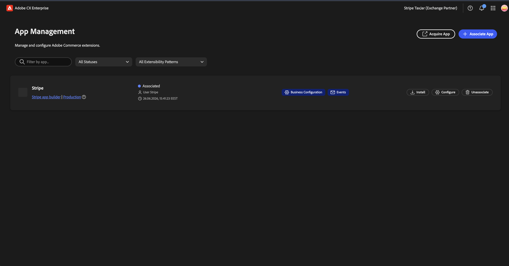

1. Select the deployed Stripe app.
1. Complete the association flow.
1. Review the installation details and click **Install**.

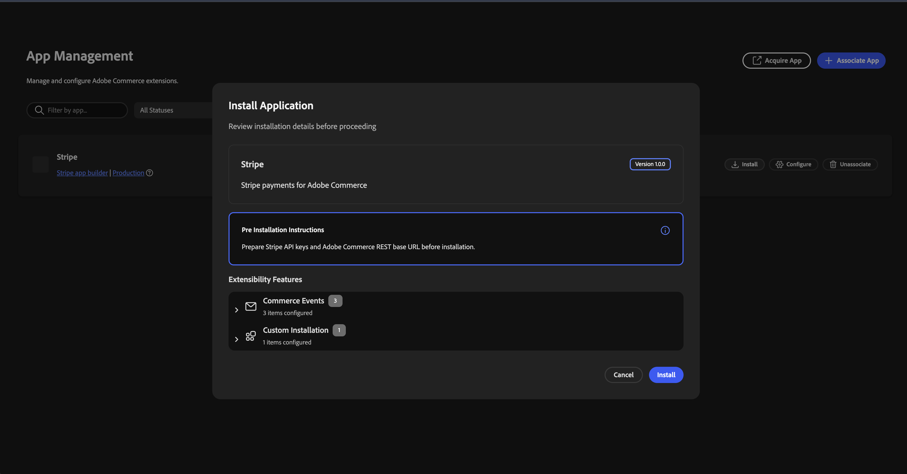

1. Wait for App Management to finish the installation.

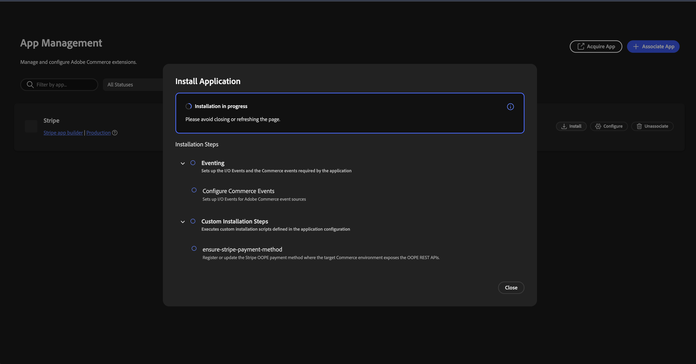

For more information, see Adobe's [App Management guide](https://experienceleague.adobe.com/en/docs/commerce/app-management/manage-app/manage-app).

### SaaS storefront action discovery

The storefront must obtain `getInitParamsUrl` and `createPaymentIntentUrl` from the Stripe payment method's Commerce GraphQL `oope_payment_method_config.backend_integration_url` value. Do not hardcode an App Builder action URL or use a temporary storefront override in production. After installation, retrieve an available payment method from Commerce and verify that its returned URLs target the deployed Stripe actions.

## Configure Stripe Webhooks

Configure the Stripe webhook after deployment:

1. Open [Stripe Webhooks](https://dashboard.stripe.com/webhooks).
1. Create a webhook endpoint for the deployed App Builder action:

   ```text
   https://<runtime-namespace>.adobeioruntime.net/api/v1/web/stripe/stripe-webhook
   ```

1. Subscribe the endpoint to these events:

   ```text
   charge.captured
   charge.refunded
   charge.succeeded
   charge.dispute.created
   payment_intent.canceled
   payment_intent.requires_action
   payment_intent.payment_failed
   payment_intent.succeeded
   ```

   These events support delayed payment methods, manual capture updates, cancellations, disputes, and refunds.

1. Save the endpoint.
1. Copy the signing secret from this exact webhook endpoint.

Do not reuse a webhook signing secret from another endpoint. Stripe creates a different signing secret for each webhook destination.

For more information, see Stripe's [webhook endpoint guide](https://docs.stripe.com/webhooks#add-a-webhook-endpoint).

## Stripe Configuration

Configure Stripe from App Management:

1. In **System** > **Apps** > **App Management**, open the installed Stripe app.
1. Click **Business Configuration** or **Configure**.

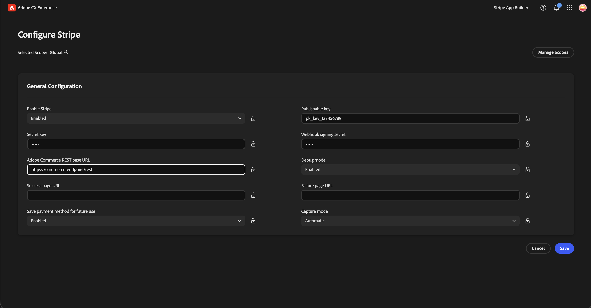

The following settings are available for configuration:

- **Enable Stripe**: Enables or disables the payment method at your storefront.
- **Publishable key and Secret key**: Stripe account API keys used to collect payments. You can find them in [Stripe API keys](https://dashboard.stripe.com/apikeys).
- **Webhook signing secret**: Stored with the App Management configuration for merchant reference. The deployed webhook action currently verifies Stripe signatures with the `STRIPE_WEBHOOK_SECRET` environment value, so set that deployment value to the signing secret from the exact webhook destination.
- **Adobe Commerce REST base URL**: The REST endpoint for your Commerce instance. For SaaS instances, find it in [Adobe Experience Cloud Commerce instances](https://experience.adobe.com/#/commerce/cloud-service/instances). For PaaS instances, use your Commerce REST base URL.
- **Debug mode**: Returns additional runtime error details while testing.
- **Success Page URL**: URL where customers are redirected after successful payment when using redirect-based payment methods (iDEAL, Bancontact, PayPal, etc.). When webhook order placement completes before the browser return, the app appends `orderRef` and `orderNumber`. If order placement is still pending, the app appends `payment_intent` and `payment_status` so the storefront can continue showing a pending or confirmation state.
- **Failure Page URL**: URL where customers are redirected if payment fails when using redirect-based payment methods. Supports `{error_message}` placeholder. Example: `https://your-store.com/checkout/failure?error={error_message}`
- **Save payment method for future use**: Allows customers to save supported payment methods.
- **Capture mode**: Choose automatic capture or manual capture. Automatic capture captures payment during checkout. Manual capture authorizes payment during checkout and captures it when the Commerce order is invoiced.

Checkout endpoint CORS is restricted to configured storefront origins. By default, the app derives allowed origins from the configured HTTPS Success Page and Failure Page URLs. Set `ALLOWED_ORIGINS` to a comma-separated list of exact HTTPS storefront origins when the checkout runs on another domain. A browser request from an unlisted origin is intentionally denied; an allowlisted origin receives the underlying application error response for troubleshooting.

### Redirect Payment Methods

The Stripe integration supports redirect-based payment methods in addition to standard card payments. These include:

- **iDEAL** (Netherlands)
- **Bancontact** (Belgium)
- **SEPA Direct Debit** (Europe)
- **Giropay** (Germany)
- **EPS** (Austria)
- And many more...

To enable these payment methods:

1. Log in to your [Stripe Dashboard](https://dashboard.stripe.com/)
2. Navigate to **Settings** > **Payment methods**
3. Enable the payment methods you want to accept
4. Configure the Success and Failure Page URLs in App Management.

**How redirect payments work:**

When a customer selects a redirect payment method:

1. Cart is configured with shipping and billing information
2. Payment Intent is created with the payment method
3. Customer is redirected to the external payment provider to authorize payment
4. After authorization, customer is redirected back to your store
5. The `payment_intent.requires_action` webhook records the redirect context
6. After authorization, `charge.succeeded` places the Commerce order from the recorded context
7. The customer is redirected to your Success or Failure Page URL with `orderRef` and `orderNumber` when available

The Stripe webhook endpoint must subscribe to `payment_intent.requires_action` for redirect payment methods. Without this event, the app cannot record the redirect context, and later `charge.succeeded` events without order metadata are acknowledged but do not place the Commerce order.

> **Notice:** If a redirect payment succeeds in Stripe but no Commerce order is created, open the Stripe webhook delivery for the `charge.succeeded` event. A `202` response with a message such as `No order reference in Payment Intent metadata` usually means the app did not receive the earlier `payment_intent.requires_action` event or could not load the current Stripe configuration. Confirm the webhook endpoint subscribes to all required events, verify that `STRIPE_WEBHOOK_SECRET` and the App Management Stripe API keys belong to the same Stripe account and mode, and clear the App Management configuration cache with `aio app state delete configuration.global` only if a saved configuration value remains stale.

Saved payment methods are scoped to the customer and supported payment method type.

## Events Configuration

Commerce events allow the app to update Stripe payments when orders, invoices, and credit memos change in Commerce. With App Management, these events are created automatically when the app is installed. The event definitions come from the app's Commerce configuration and are delivered to the private `stripe/events-handler` Runtime Action; do not create a public webhook registration for these events.

During installation, App Management shows the Commerce Events step before the custom installation step. On PaaS, that custom step registers or updates the Stripe OOPE payment method through the available OOPE REST APIs. On SaaS, Commerce App Management owns the payment-method association.

On the **Configure event registration** page, select the generated event provider, click **Next**, select the Commerce events to subscribe to, and click **Next** again.

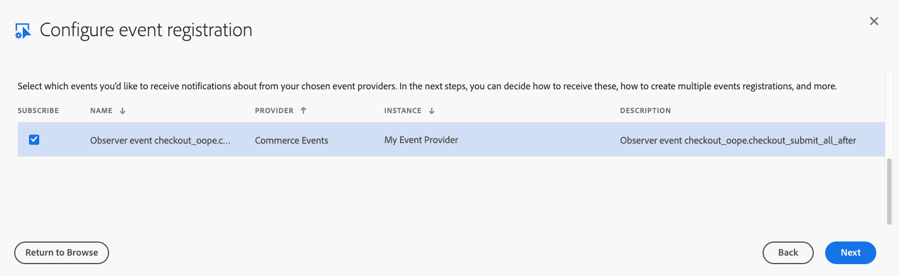

For reference, the app installs these Commerce events:

```text
observer.sales_order_save_after
observer.sales_order_invoice_save_after
observer.sales_order_creditmemo_save_after
```

After installation, verify the generated event registration from Commerce Admin:

1. Go to **System** > **Apps** > **App Management**.
1. Open the installed Stripe app.
1. Click **Events**.
1. Confirm the event provider is present and the subscribed events include the order, invoice, and credit memo observers listed above.

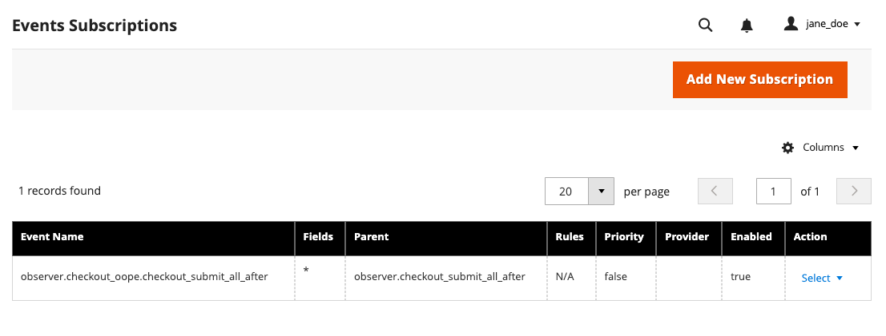

Use the **Events** button only to review the generated event registration. For more information, including PaaS manual setup when App Management is not managing the registration, see Adobe's [Adobe I/O Events for Adobe Commerce documentation](https://developer.adobe.com/commerce/extensibility/events/).

## Validate the installation

Run a test checkout before enabling live payments:

1. Open the Commerce storefront.
1. Create a cart and add a product.
1. Add customer email, shipping address, billing address, and shipping method.
1. Select Stripe as the payment method.
1. Confirm the payment with a [Stripe test payment method](https://docs.stripe.com/testing).
1. Place the order.
1. Confirm the order is created in Commerce.
1. Confirm the payment appears in the [Stripe payments dashboard](https://dashboard.stripe.com/payments).
1. Confirm the order identifiers appear on the Stripe payment metadata or description.

Validate the admin flows that apply to the store:

- **Automatic capture**: Place an order and confirm the payment is captured during checkout.
- **Manual capture**: Set capture mode to manual, place an order, then create an invoice in Commerce Admin to capture the payment.
- **Stripe Dashboard capture**: If a manual-capture payment is captured directly in Stripe, confirm Commerce records an order comment. This does not create a Commerce invoice.
- **Refunds**: Create a full or partial credit memo in Commerce Admin and confirm the refund appears in Stripe. See [Stripe refunds](https://docs.stripe.com/refunds).
- **Saved payment methods**: Enable saved payment methods, place a test order, and confirm the supported payment method is saved in Stripe.

## Add Stripe to your EDS storefront

You can add the Stripe payment method at the checkout page of your EDS storefront by utilizing a pre-built EDS block,
which includes all functionality needed to render the payment form, collect the payment and place the order.

You can find this EDS block at [https://github.com/stripe/stripe-magento2-releases/tree/master/app-builder/blocks/stripe-payment](https://github.com/stripe/stripe-magento2-releases/tree/master/app-builder/blocks/stripe-payment). Instructions on how to integrate it with your EDS storefront can be found inside the [README.md](https://github.com/stripe/stripe-magento2-releases/tree/master/app-builder/blocks/stripe-payment/README.md) file at the same location.

## Troubleshooting

### App Management Configuration Cache

If App Management saves successfully but checkout or Commerce events still use older Stripe configuration, clear only the App Management global configuration cache key for the selected App Builder workspace:

Run the command from the app root directory that contains `app.config.yaml` and `.env`:

```bash
aio app state delete configuration.global
```

Do not run `aio app deploy --force-events` for this issue.

### **[PaaS Only]** Stripe Configuration Save Fails with 404 Error

If saving configuration returns `Failed to update payment methods: [404] Request does not match any route.`, confirm that `magento/module-out-of-process-payment-methods` is installed and enabled.

### **[PaaS Only]** Authorization Error when Saving Stripe Configuration

If saving configuration returns `The consumer isn't authorized to access Magento_OutOfProcessPaymentMethods::oope_payment_method_create`, update the Commerce integration API permissions for out-of-process payment methods.

### **[PaaS Only]** Module Installation Issues

If PaaS module installation or `setup:upgrade` fails, verify module versions, module enablement, and file permissions from the Adobe Commerce application root directory:

```bash
# Run from the Adobe Commerce application root directory, where bin/magento exists
composer show magento/module-out-of-process-payment-methods
composer show magento/commerce-eventing
composer show magento/commerce-backend-sdk
composer show magento/adobe-ims

php bin/magento module:status Magento_OutOfProcessPaymentMethods
php bin/magento module:status Magento_AdobeCommerceEventsClient
php bin/magento module:status Magento_AdobeCommerceEventsGenerator
php bin/magento module:status Magento_AdobeCommerceEventsMeta
php bin/magento module:status Magento_AdminUISDK
php bin/magento module:status Magento_AdobeIms
php bin/magento module:status Magento_AdminAdobeIms
```

If a required module is disabled, enable it and apply Commerce setup changes:

```bash
# Run from the Adobe Commerce application root directory, where bin/magento exists
php bin/magento module:enable \
   Magento_OutOfProcessPaymentMethods \
   Magento_AdobeCommerceEventsClient \
   Magento_AdobeCommerceEventsGenerator \
   Magento_AdobeCommerceEventsMeta \
   Magento_AdminUISDK \
   Magento_AdobeIms \
   Magento_AdminAdobeIms

php bin/magento setup:upgrade
php bin/magento setup:di:compile
php bin/magento cache:flush
```

If generated classes, cache, or static content cannot be written, fix ownership and permissions for the Commerce writable directories. Replace `www-data` with the web server user used by the Commerce instance, such as `magento`, `apache`, or `nginx`:

```bash
# Run from the Adobe Commerce application root directory, where bin/magento exists
sudo chown -R www-data:www-data var generated pub/static pub/media
find var generated pub/static pub/media -type d -exec chmod 775 {} \;
find var generated pub/static pub/media -type f -exec chmod 664 {} \;
php bin/magento cache:flush
```

### Authentication Issues

If you cannot access the Stripe configuration, confirm that the app is installed in [Adobe Commerce App Management](https://experienceleague.adobe.com/en/docs/commerce/app-management/manage-app/manage-app) and the selected [Adobe Developer Console](https://developer.adobe.com/console/) workspace matches the deployed app.

### Webhook and Event Issues

If Stripe webhooks do not process, confirm the endpoint is active in [Stripe Webhooks](https://dashboard.stripe.com/webhooks), the deployed `STRIPE_WEBHOOK_SECRET` belongs to that exact endpoint, and the endpoint receives `2xx` responses.

If redirect payments succeed in Stripe but do not create Commerce orders, check these items first:

1. Confirm the Stripe webhook endpoint is subscribed to `payment_intent.requires_action` and `charge.succeeded`.
1. Confirm the deployed `STRIPE_WEBHOOK_SECRET` belongs to the same webhook endpoint that receives the events.
1. Confirm the publishable and secret keys are from the same Stripe account and mode as the webhook endpoint.
1. After changing App Management configuration, clear the runtime configuration cache from the app root directory:

   ```bash
   aio app state delete configuration.global
   ```

1. Retry the redirect payment with a new cart.

If Commerce events do not process, verify the App Management installation and generated event registration:

1. In Commerce Admin, go to **System** > **Apps** > **App Management**.
1. Open the installed Stripe app and confirm the app status is installed.
1. Click **Events**.
1. Confirm the generated provider is present.
1. Confirm the subscribed events include `observer.sales_order_save_after`, `observer.sales_order_invoice_save_after`, and `observer.sales_order_creditmemo_save_after`.
1. In [Adobe Developer Console](https://developer.adobe.com/console/), open the same project and workspace, then review the event registration connected to the app runtime action.

For PaaS manual setup when App Management is not managing the registration, use Adobe's [Adobe I/O Events for Adobe Commerce documentation](https://developer.adobe.com/commerce/extensibility/events/).

### Feature Comparison

| Feature               | SaaS           | PaaS              |
| --------------------- | -------------- | ----------------- |
| IMS Authentication    | Required       | Recommended       |
| Integration Auth      | Not Available  | Alternative       |
| Pre-installed Modules | Yes            | Manual Install    |
| Admin UI SDK          | Pre-configured | Requires Setup    |
| EDS Storefront        | Direct Support | Additional Config |
| Luma Storefront       | Not Available  | Available         |

For more information about PaaS compatibility, see Adobe's [Extension Compatibility Guide](https://developer.adobe.com/commerce/extensibility/app-development/extension-compatibility/).
