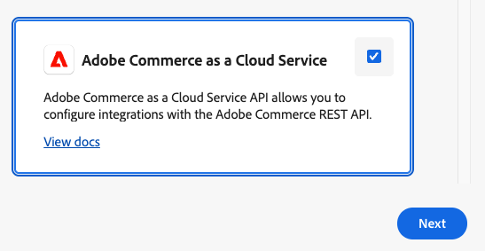

# Installing the Stripe app for Adobe Commerce

## Overview

This guide walks you through installing the Stripe app for **Adobe Commerce** via the Adobe Exchange marketplace. The app integrates Stripe's payment processing with Adobe Commerce to support modern, secure, out-of-process payment processing; without modifying your core Commerce application. Instead of installing modules directly into the codebase (in-process extensibility), it supports out-of-process extensibility using Adobe App Builder. These apps run securely and independently in Adobe I/O Runtime and integrate with your [Adobe Commerce Storefront](https://experienceleague.adobe.com/developer/commerce/storefront/) via the GraphQL APIs and Adobe I/O events.

## Supported platforms

The Stripe app currently supports Adobe Commerce as a Cloud Service (SaaS). Support for Adobe Commerce on cloud infrastructure (PaaS) and Adobe Commerce on-premises is coming very soon.

## Before you begin

### Set up Adobe Commerce as a Cloud Service

Before you begin, you will first need to have an instance of Adobe Commerce as a Cloud Service running. You can create one by:

1. Navigating to [Experience Cloud Console](https://experience.adobe.com/)
1. Under **Quick Access**, click **Commerce**
1. At the top right hand side of the page, click **Add instance**

   

If you are testing the app on a sandbox / development environment, you can import [available sample data](https://github.com/slamech/commerce-sample-data) from Adobe to your Commerce instance.

### Set up your Stripe account

You can register for a Stripe account via [Stripe's website](https://dashboard.stripe.com/register). After registering, you can access your Stripe API keys via:

- Test Mode: [https://dashboard.stripe.com/test/apikeys](https://dashboard.stripe.com/test/apikeys)
- Live Mode: [https://dashboard.stripe.com/apikeys](https://dashboard.stripe.com/apikeys)

### Set up App Builder

#### Obtain a license

You will need a [license for App Builder](https://developer.adobe.com/app-builder/docs/get_started/app_builder_get_started/set-up#access-and-credentials) in order to deploy the app. App Builder is necessary so that you can configure IMS authentication credentials, configure Commerce I/O Events, persist data to Adobe I/O Lib Files, or generate encryption keys for your environment file.

You can sign up to a trial of App Builder via [https://developer.adobe.com/app-builder/trial/](https://developer.adobe.com/app-builder/trial/).

#### Create the project

Once you have an App Builder license, navigate to [Adobe Developer Console](https://developer.adobe.com/console/). You should see there a **Create project from template**
button, indicating that your App Builder license is active:


Click on the **Create project from template** button, and select App Builder as a template:


Fill the project details and click save:


#### Add necessary APIs to the project

1. Select an environment, such as **Stage** or **Production**, click the **Add service** button, and then select **API**.

   

1. Select **Adobe I/O Events for Adobe Commerce** and add it to the environment.

   

1. Repeat the same steps, and add the **I/O Management API** to the environment.

   

1. Repeat the same steps, and add the **Adobe Commerce as a Cloud Service** to the environment.

   

#### Set up your local environment

Before you can deploy the app to App Builder, you will additionally need to install **Node.js** and the **Adobe I/O CLI** package.
Please follow [the official instructions](https://developer.adobe.com/app-builder/docs/get_started/app_builder_get_started/set-up#local-environment-setup) to set up your local environment.

## Install the App via Adobe Exchange Marketplace

To install the Stripe app, follow the steps below:

1. Navigate to the app's listing on the [Adobe Exchange Marketplace](https://exchange.adobe.com/apps/browse/ec?appType=ABD&listingType=applications&page=1&partnerLevel=All&product=COMMC&q=stripe&sort=RELEVANCE)
1. Click on the app listing to view it.
1. At the top right hand side, click the **Free** button and follow the instructions to install the app into your organization's environment.
1. The app will appear under [Adobe Exchange App Management](https://exchange.adobe.com/manage). If you are an account admin, click the **Review** button on the app page in order to approve it.
1. At the app's page, you will see a **Download Code** button at the top bar. Click it to download the app's code locally. You will need the code to set up your OAuth Credentials.
   
1. Extract the downloaded code to a local directory, and use the CLI to run the following commands:

   ```sh
   # Navigate to the extracted project directory
   cd path/to/extracted/stripe-app

   # Login and configure Adobe CLI (run from the project root directory)
   aio login -f
   aio console org select
   aio console project select
   aio console workspace select
   aio app use --merge
   ```

1. Confirm that the `.env` and `.aio` files were added to the project directory, and run the following command:

   ```bash
   # Run from the Stripe app project root directory
   npm run sync-oauth-credentials
   ```

   This will generate entries in the `.env` file:

   ```env
   OAUTH_CLIENT_ID=
   OAUTH_CLIENT_SECRETS=[""]
   OAUTH_TECHNICAL_ACCOUNT_ID=
   OAUTH_TECHNICAL_ACCOUNT_EMAIL=
   OAUTH_SCOPES=[""]
   OAUTH_IMS_ORG_ID=
   ```

   The above values will be read by the deployed app's runtime actions, in order to create access tokens for the Adobe Commerce Admin API.

1. Generate and add encryption keys for sensitive credentials by running the following command:

   ```sh
   # Run from the Stripe app project root directory
   npm run generate-encryption-key
   ```

   The command will output two environment variables which you need to add to your `.env` file:

   ```env
   ENCRYPTION_KEY=
   ENCRYPTION_IV=
   ```

1. Install app dependencies:

   ```sh
   # Run from the Stripe app project root directory
   npm install
   ```

1. Deploy the updated app:

   ```sh
   # Run from the Stripe app project root directory
   aio app deploy
   ```

## Stripe Configuration

Before you can access the Stripe configuration page, you will need to register the Stripe app in your Adobe Commerce admin area. You can do that by following the steps below:

1. Log into your Adobe Commerce admin area.
1. Navigate to **Stores** > Settings > **Configuration > Adobe Services > Admin UI SDK**

   

1. Enable the **Admin UI SDK** and set the **Refresh registrations on schedule** to daily.
1. Click **Configure extensions**.

   

1. Select the Stripe app and click **Save**.
1. A Stripe menu will appear on the sidebar. Click **Stripe Configuration**.

   

1. The main configuration screen will appear.

   

The following settings are available for configuration

- **Enable**: Will enable or disable the payment method at your storefront.
- **Publishable and Private Key**: These are the Stripe account API keys which will be used to collect payments. You can find these at [https://dashboard.stripe.com/apikeys](https://dashboard.stripe.com/apikeys)
- **Adobe Commerce URL**: This is the REST API endpoint of your Adobe Commerce as a Cloud Service instance. You can get this by navigating to your [Commerce instances](https://experience.adobe.com/#/commerce/cloud-service/instances), and clicking the information icon (i) next to to the Commerce instance you want to connect to. A modal will appear listing the **REST endpoint**.
- **Debug**: If you will be building your EDS storefront, Debug mode may return additional error details on various API calls to the app's runtime.

## Events Configuration

With the app configured, the next step is to subscribe to events emitted by your Adobe Commerce as a Cloud Service instance.
This will allow the app to update payments in your Stripe dashboard with order details, and automatically invoice orders that have been paid.

1. At the top right of the environment page, click **Download all**.

   

   The downloaded file includes metadata in json format about the app. Open the file in a text editor and copy its contents.

1. Navigate to your Adobe Commerce admin under **Stores > Settings > Configuration > Adobe Services > Adobe I/O Events > General configuration**.

   

1. In the **Adobe I/O Workspace Configuration**, paste the contents of the metadata file that you just downloaded.
1. In the **Adobe I/O Event Provider Instance ID**, enter a unique identifier for your Commerce instance. You will connect to this provider ID when subscribing to events.
1. Click **Save Config** to save the configuration.
1. Click **Create Event Provider** to create the event provider. You will be asked to specify a label and description for it. Enter any values you like and click **Submit**.
1. Under the **Commerce events** section, set **Enabled** to **Yes** and save the configuration.

   

1. You can optionally test the connection by clicking **Send Test Event**.
1. Navigate to System > Events > Events Subscriptions. Click **Add new subscription**, and add the **observer.checkout_oope.checkout_submit_all_after** event.

   

1. Return to your app environment. Click the **Add service** pop-up menu and select **Event**.

   

1. On the **Add events page**, select **Commerce events**. Then click **Next**.

   

1. On the **Configure event registration** page, select your event provider. Then click **Next**.
1. Select the events to subscribe to. Then click **Next**.

   

1. Update the **Event registration** name and **Event registration description** fields, for example, you can use **Order placed event**.
1. You will be asked how you would like to receive events. Select **Runtime action**, and then select the **stripe/validate-payment** action.

   

1. Click **Save configured events**.
1. The new event subscription will appear in the app's environment. You are now ready to start receiving events.

   

## Add Stripe to your EDS storefront

You can add the Stripe payment method at the checkout page of your EDS storefront by utilizing a pre-built EDS block,
which includes all functionality needed to render the payment form, collect the payment and place the order.

You can find this EDS block at [https://github.com/stripe/stripe-magento2-releases/tree/master/app-builder/blocks/stripe-payment](https://github.com/stripe/stripe-magento2-releases/tree/master/app-builder/blocks/stripe-payment). Instructions on how to integrate it with your EDS storefront can be found inside the [README.md](https://github.com/stripe/stripe-magento2-releases/tree/master/app-builder/blocks/stripe-payment/README.md) file at the same location.